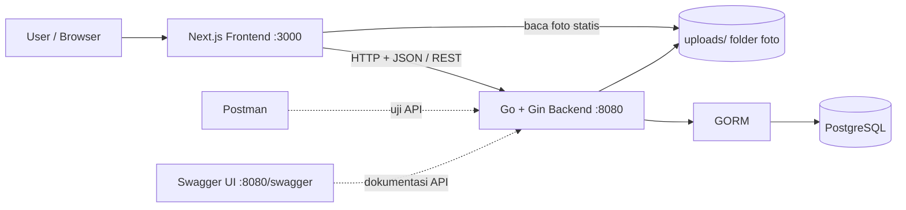
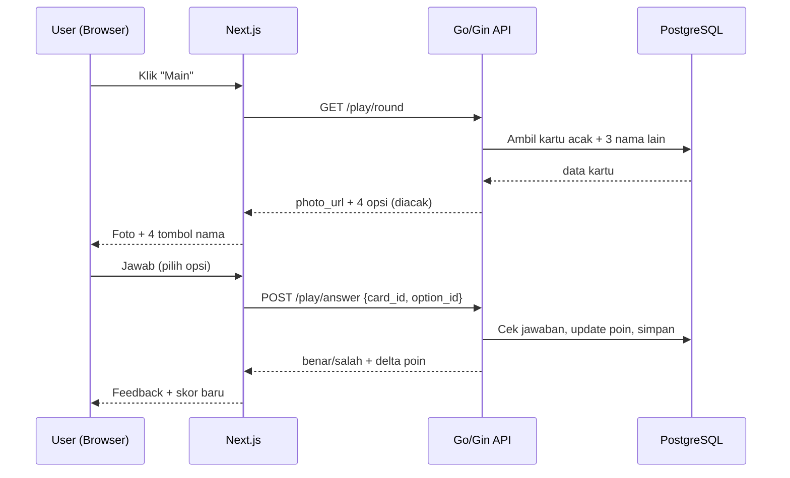
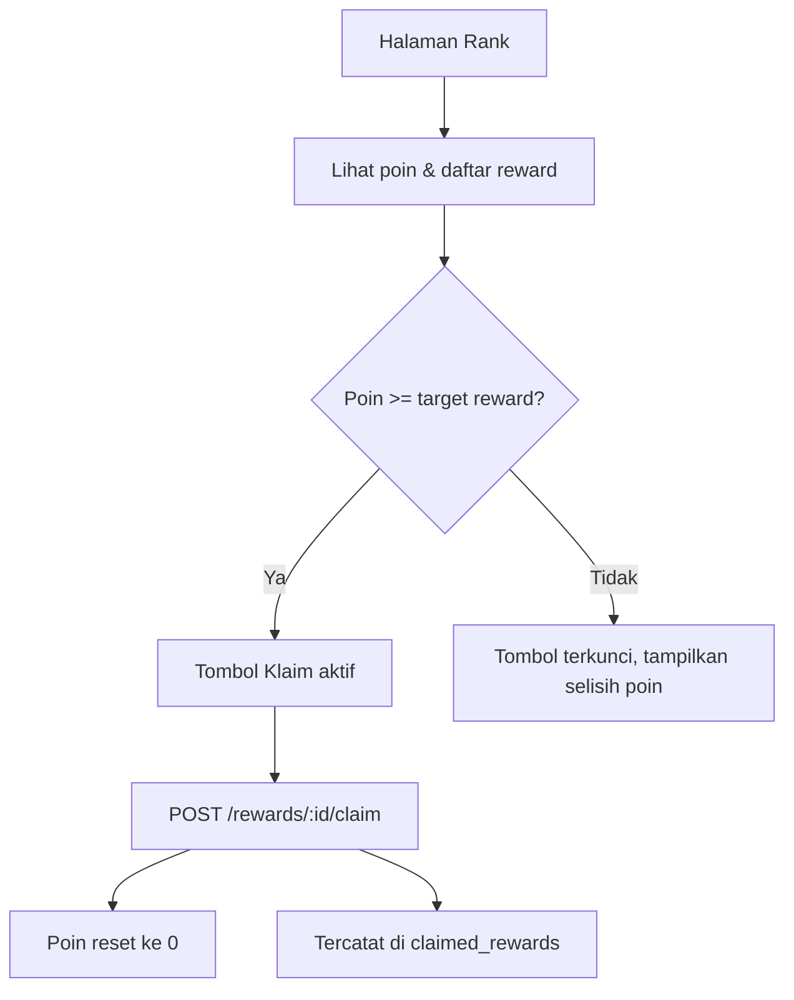
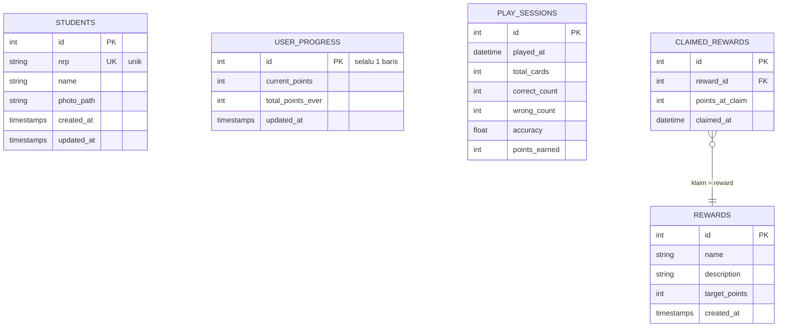

# 📇 FlashCard Angkatan — Spesifikasi Proyek

> Aplikasi **flashcard** untuk mengingat nama mahasiswa satu angkatan.
> Kamu melihat foto temanmu → menebak namanya → mengumpulkan poin → merayakan dengan **self-reward**.

**Status:** Fase 2 selesai (Play flashcard + skor); Fase 3 (Rank/reward) berikutnya
**Dokumen oleh:** Big Pickle · dipersiapkan bersama pemilik proyek

---

## 1. Ringkasan

Aplikasi web pribadi untuk menghafal nama mahasiswa seangkatan lewat permainan flashcard interaktif.

- Munculkan **foto** seorang mahasiswa
- Tebak **nama** dari 4 pilihan
- Benar **+2 poin**, salah **-1 poin**
- Poin menumpuk lintas sesi
- Saat poin mencapai target **reward**, kamu boleh mengklaim hadiah (self-reward) → poin **reset ke 0**

---

## 2. Fitur Utama

### 2.1 Fitur Add — Kelola Data Mahasiswa

| No | Kemampuan | Keterangan |
|----|-----------|------------|
| 1 | **Tambah mahasiswa** | Form: nama, NRP (unik), foto (upload file atau URL) |
| 2 | **Edit mahasiswa** | Ubah nama, NRP, atau ganti foto |
| 3 | **Hapus mahasiswa** | Hapus beserta filenya (butuh konfirmasi) |
| 4 | **List & pencarian** | Daftar semua mahasiswa, pagination, cari berdasarkan nama/NRP |
| 5 | **Import massal CSV** | Import ratusan data sekaligus: kolom `nrp, nama, photo_url` |
| 6 | **Validasi** | NRP wajib unik; foto wajib ada sebelum bisa muncul di permainan |

### 2.2 Fitur Play — Bermain Flashcard

| No | Kemampuan | Keterangan |
|----|-----------|------------|
| 1 | **Kartu acak** | Satu kartu menampilkan satu **foto** (nama disembunyikan) |
| 2 | **Multiple choice 4 opsi** | 1 nama benar + 3 nama acak (nama tidak boleh ada yang sama) |
| 3 | **Penilaian instan** | Benar **+2**, salah **-1** (poin tidak bisa turun di bawah 0) |
| 4 | **Umpan balik** | Setelah menjawab tampil benar/salah + nama yang benar |
| 5 | **Tidak berulang** | Dalam satu sesi, kartu tidak muncul dua kali |
| 6 | **Akhir sesi** | Setelah semua kartu habis → ringkasan: benar, salah, akurasi, poin diperoleh |
| 7 | **Riwayat tersimpan** | Setiap sesi dicatat ke tabel `play_sessions` |

### 2.3 Fitur Rank — Poin & Self-Reward

| No | Kemampuan | Keterangan |
|----|-----------|------------|
| 1 | **Poin kumulatif** | Poin menumpuk antar sesi hingga diklaim |
| 2 | **Daftar reward** | Reward punya **target poin masing-masing** (mis. 50, 100, 200) |
| 3 | **Klaim reward** | Jika poin ≥ target reward → klik klaim → poin **reset ke 0**, riwayat klaim tercatat |
| 4 | **Progres visual** | Progress bar menuju reward berikutnya + statistik akumulasi |
| 5 | **Statistik permainan** | Riwayat sesi: tanggal, benar, salah, akurasi, poin diperoleh |

---

## 3. Tech Stack

| Lapisan | Teknologi |
|---------|-----------|
| **Frontend** | Next.js (App Router) |
| **Backend** | Go + Gin |
| **Database** | PostgreSQL + GORM (ORM) |
| **API Tools** | Postman (manual testing) + Swagger/OpenAPI (dokumentasi, via swaggo) |
| **VCS** | Git + GitHub |
| **Ops (opsional)** | Docker Compose untuk PostgreSQL lokal |

---

## 4. Arsitektur

### 4.1 Gambaran umum



**Alur request:** Next.js (SSR/client) memanggil API REST Go di port berbeda → dipisahkan oleh **CORS** yang dikonfigurasi di backend.

### 4.2 Alur bermain



### 4.3 Alur klaim reward



---

## 5. Skema Database (GORM)



**Catatan desain:**
- `user_progress` **selalu satu baris** (single user, tanpa login) — menyimpan poin berjalan dan total poin sepanjang masa
- `claimed_rewards` menyimpan snapshot `points_at_claim` untuk riwayat klaim
- `play_sessions.accuracy` dihitung = `correct_count / total_cards`
- Migrasi memakai `AutoMigrate` GORM (dengan reserve untuk migrasi SQL manual)

---

## 6. Desain API (REST)

Base URL: `http://localhost:8080/api/v1` · Format: JSON

### 6.1 Mahasiswa (`/students`)

| Method | Endpoint | Deskripsi | Body / Param |
|--------|----------|-----------|--------------|
| `POST` | `/students` | Tambah mahasiswa | `{ nrp, name, photo_url? }` atau multipart |
| `GET` | `/students` | Daftar (pagination + search) | `?page=1&limit=10&search=andi` |
| `GET` | `/students/:id` | Detail satu mahasiswa | — |
| `PUT` | `/students/:id` | Update mahasiswa | `{ nrp?, name?, photo_url? }` |
| `DELETE` | `/students/:id` | Hapus mahasiswa | — |
| `POST` | `/students/import` | Import CSV massal | multipart file `.csv` |
| `POST` | `/upload` | Upload file foto | multipart `file`, limit 5 MB |

**Format CSV import:**
```csv
nrp,nama,photo_url
5025201001,Andi Pratama,https://example.com/andi.jpg
5025201002,Budi Santoso,/uploads/17-budi.jpg
```

### 6.2 Permainan (`/play`)

| Method | Endpoint | Deskripsi | Response |
|--------|----------|-----------|----------|
| `GET` | `/play/round` | Ambil kartu acak + 4 opsi | `{ card_id, photo_url, options: [{id, name}x4] }` |
| `POST` | `/play/answer` | Kirim jawaban | body `{ card_id, option_id }` → `{ correct, points_delta, current_points, correct_name }` |
| `POST` | `/play/end` | Akhiri sesi & simpan history | body `{ total_cards, correct_count, wrong_count }` → `{ session_id, points_earned }` |

**Aturan opsi:** `GET /play/round` memilih 3 nama acak selain jawaban benar; server mengacak urutan 4 opsi. Klien **tidak boleh** menerima penanda jawaban benar dalam payload (opsi return sebagai array sederhana).

### 6.3 Reward & Progress (`/rewards`, `/progress`)

| Method | Endpoint | Deskripsi |
|--------|----------|-----------|
| `GET` | `/rewards` | Daftar semua reward + target |
| `POST` | `/rewards` | Tambah reward `{ name, description, target_points }` |
| `PUT` | `/rewards/:id` | Ubah reward |
| `DELETE` | `/rewards/:id` | Hapus reward |
| `GET` | `/progress` | Poin berjalan, total poin, reward terdekat, progress bar |
| `POST` | `/rewards/:id/claim` | Klaim reward (validasi poin ≤ target) → reset poin |
| `GET` | `/sessions` | Riwayat sesi permainan (`play_sessions`) |

**Dokumentasi:** endpoint ditandai anotasi `swaggo` → Swagger UI di `http://localhost:8080/swagger/index.html`.

---

## 7. Aturan Skor & Reward

| Aturan | Nilai |
|--------|-------|
| Jawaban benar | **+2 poin** |
| Jawaban salah | **-1 poin** |
| Batas bawah poin | **0** (tidak pernah negatif) |
| Poin antar sesi | **Menumpuk** (kumulatif) |
| Reset poin | Saat berhasil **klaim reward** |
| Syarat klaim | `current_points >= reward.target_points` |
| Isi reward | Bebas sesuai keinginan user (mis. "nonton 1 episode", "jajan bakso") |
| Riwayat klaim | Tersimpan di `claimed_rewards` |

---

## 8. Struktur Direktori (Monorepo)

```
opencode-project/
├── docs/
│   └── PROJECT.md              ← dokumen ini
├── frontend/                   # Next.js (App Router)
│   ├── app/
│   │   ├── page.tsx            # Landing / menu utama
│   │   ├── add/page.tsx        # Tambah & kelola mahasiswa
│   │   ├── play/page.tsx       # Permainan flashcard
│   │   └── rank/page.tsx       # Poin, reward, statistik
│   ├── components/
│   ├── lib/                    # API client (fetch ke backend)
│   └── package.json
├── backend/                    # Go + Gin
│   ├── cmd/
│   │   └── main.go             # Entry point, router, konfigurasi
│   ├── internal/
│   │   ├── handlers/           # Gin handlers per resource
│   │   ├── models/             # Struct GORM
│   │   ├── database/           # Koneksi & AutoMigrate
│   │   └── middlewares/        # CORS, logging
│   ├── docs/                   # Hasil generate swagger (swaggo)
│   ├── uploads/                # Folder foto (gitignored)
│   ├── go.mod
│   └── .env
├── uploads/  (atau symlink/handle via backend)
└── README.md                   # Cara menjalankan
```

---

## 9. Konfigurasi Lingkungan

**`.env` (backend):**
```env
PORT=8080
DB_HOST=localhost
DB_PORT=5432
DB_USER=postgres
DB_PASSWORD=secret
DB_NAME=flashcard
UPLOAD_DIR=./uploads
MAX_UPLOAD_SIZE=5242880        # 5 MB
CORS_ORIGIN=http://localhost:3000
```

**Next.js:** `.env.local` berisi `NEXT_PUBLIC_API_BASE_URL=http://localhost:8080/api/v1`

**Docker Compose (PostgreSQL lokal, opsional):**
```yaml
services:
  db:
    image: postgres:16
    environment:
      POSTGRES_USER: postgres
      POSTGRES_PASSWORD: secret
      POSTGRES_DB: flashcard
    ports:
      - "5432:5432"
    volumes:
      - pgdata:/var/lib/postgresql/data
volumes:
  pgdata:
```

---

## 10. Detail Implementasi Penting

1. **Foto tanpa file**: mahasiswa tanpa foto **tidak ikut** dalam permainan (skor tidak terdistorsi)
2. **Foto server lokal**: upload disimpan di `backend/uploads/`, disajikan statis di `/uploads/*`
3. **CSV import**: proses transaksional — jika ada baris NRP duplikat/format salah, import **dibatalkan** dan error dilaporkan per baris
4. **Anti-cheat ringan**: opsi pilihan dihasilkan server, jawaban divalidasi server (poin tidak bisa dimanipulasi dari klien)
5. **Akurasi** dibulatkan 2 desimal (persen)
6. **CORS**: hanya izinkan origin frontend (`http://localhost:3000`)

---

## 11. Menjalankan di Lokal (Target Akhir)

```bash
# 1. Jalankan database
docker compose up -d db

# 2. Backend (Go)
cd backend
go mod tidy
go run cmd/main.go        # → http://localhost:8080

# 3. Frontend (Next.js)
cd frontend
npm install
npm run dev               # → http://localhost:3000

# 4. Dokumentasi API
# Buka http://localhost:8080/swagger/index.html (setelah generate swag)
```

---

## 12. Workflow Git & GitHub

- Branch utama: `main` (selalu bisa dijalankan)
- Setiap fitur dikerjakan di branch: `feature/add-student`, `feature/play`, `feature/reward`
- Commit bergaya **Semantic**: `feat:`, `fix:`, `docs:`, `refactor:`, `chore:`
- Perubahan besar lewat **Pull Request** ke `main` (minimal review sendiri)
- `.gitignore` mengecualikan `node_modules/`, `backend/uploads/`, `.env`

---

## 13. Roadmap Pengembangan

| Fase | Isi | Keluaran |
|------|-----|----------|
| **Fase 1** ✅ | Setup monorepo, model GORM, koneksi DB, CRUD mahasiswa + upload foto + import CSV | Data mahasiswa bisa dikelola |
| **Fase 2** ✅ | API play (round/answer/end), skor +2/-1, riwayat sesi | Flashcard bisa dimainkan |
| **Fase 3** | Reward CRUD, progress UI, klaim & reset poin, statistik | Fitur rank lengkap |
| **Fase 4** | Swagger lengkap, error handling, validasi, tes (Go test + coba Postman), polish UI | Siap dipakai harian |

---

## 14. Ide Pengembangan Masa Depan (Out of Scope Awal)

- Multi-user + login + leaderboard antar teman
- Mode "ketik nama" dengan fuzzy matching
- Pengulangan cerdas (kartu yang sering salah muncul lebih dulu / spaced repetition)
- Backup foto ke cloud storage (S3/MinIO)
- Deploy ke server/Vercel + Docker penuh